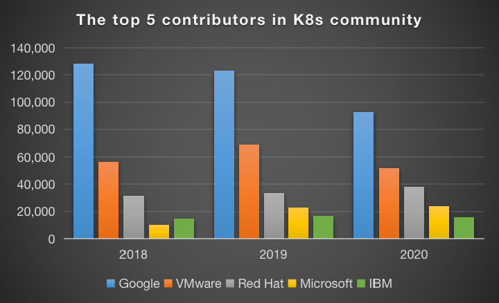
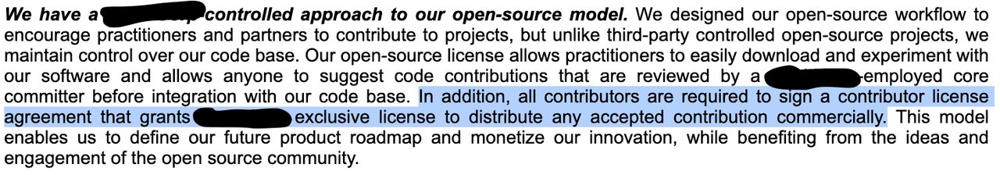

# Time to review the open source CLA

> Version 0.1
> Date: Dec. 22, 2021

**Are open source companies claiming too much from their contributors?**

The investment in open source software (OSS) is the hottest in the past decade. Although the number of fundraising events didn't increase, the money raised has more than tripled in 2021.

***Funding charts***

> **Notes:**
>
> 1. Data collected from Crunchbase with 'open source' as the organization industries.
> 2. Not all companies disclosed the money raised in the fundraising events.
> 3. The data for 2021 is between Jan. 1st to Dec. 13th.

Besides the money raised, there have been more unicorn companies and well-known IPO events in the open source world in 2021. Overall, these are positive signals to the so-called open source industry. More investment and success stories could improve the sustainability of OSS projects. It inspires more people to join the open source world as contributors or startup founders.

But more money and more attention also bring new issues to the open source world. Since the potential valuation of OSS projects goes high, taking the leadership of good OSS projects is a profitable action. In some cases, there is intense competition on the contributions to OSS projects, for example, Kubernetes.

This is still a benign competition. But we could also find some tricky cases about how the OSS project owners try to control the community contributors.

> The exclusive license in an open source project

Why did I mask the company name?

I am not going to criticize any particular company in this article.  Because what they do is, in fact, to follow the "industrial standard practice" at this moment. We should discuss if the "industrial standard practice" is reasonable rather than the right or wrong of some companies.
